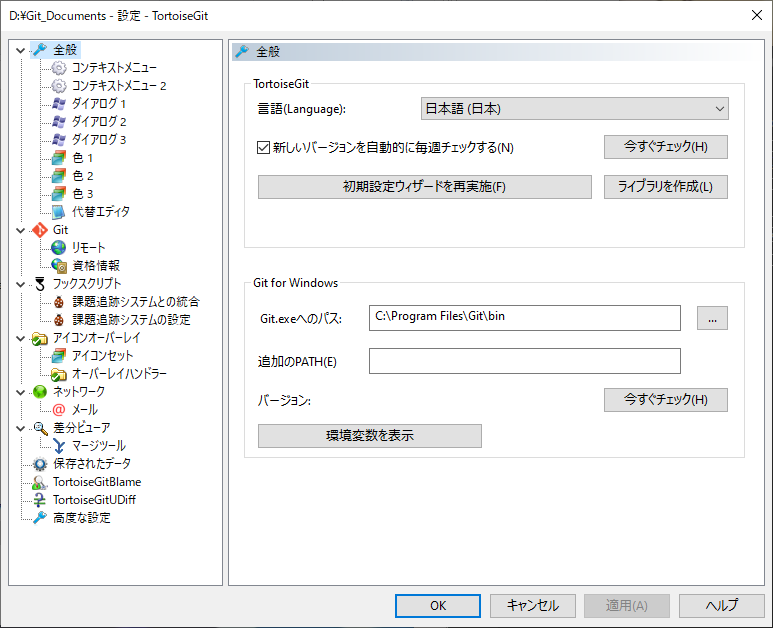

# ■TortoiseGit 

記述：2022/04/17

---
## ■注意事項
**※注意事項**

---
## ■参考URL
[TortoiseGit（公式）](https://tortoisegit.org/)

[ortoiseGitのインストール方法(日本語化まで)@Windows](https://qiita.com/Shi-nakaya/items/43c858ea707770c03b17)

---
## ■インストール手順

---
## ■日本語化手順
|手順|画像|説明|
|:--:|:--|:--|
|1||TortoiseGit（公式）のダウンロードページの「Language Packs」から、日本語化パックをダウンロード|
|2||(1)でダウンロードした「TortoiseGit-LanguagePack_XXX.exe」を実行 「次へ」を選択|
|3||しばらくすると、インストールは完了|
|4||適当な箇所を右クリックし、メニューから「TortoiseGit」→「Settings」を選択|
|5||Settingsウィンドウから、「General」→「Language」の項目を「日本語」に変更し「OK」を実行|
|6||日本語になっていれば完了|